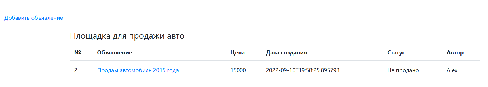
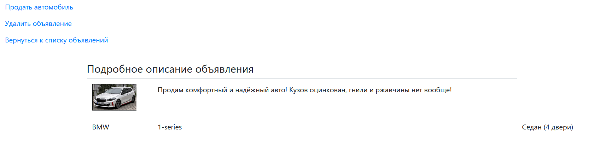
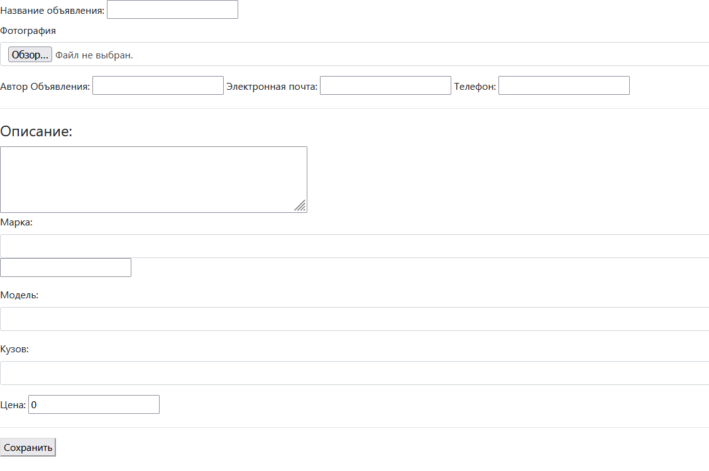

# Проект сайт по продаже машин

На сайте должны быть объявления. 
В объявлении должно быть: описание, марка машины, тип кузова, фото.
Объявление имеет статус продано или нет.

На главной странице можно увидеть все объявления
И ссылка на создание топика.

Кликнув название объявления, мы можем перейти на страницу подробного описания,
где есть возможность удалить объявление, перевести в статус продано и вернуться на начальную страницу

Страница создания объявления:
